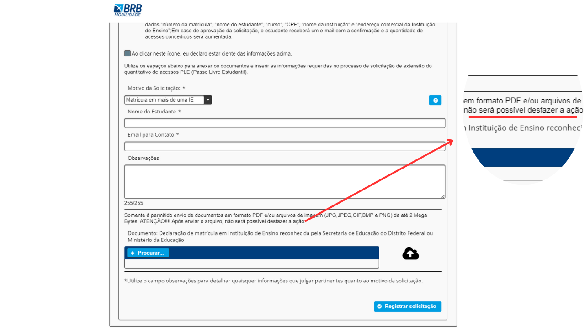
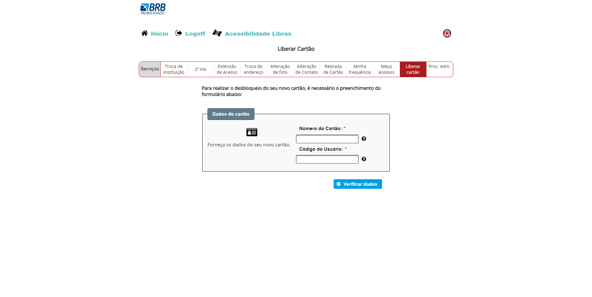

# Metas de Usabilidade

## Introdução
A usabilidade, no contexto da interação humano-computador,   refere-se à eficácia, eficiência e satisfação com que os usuários podem interagir com um sistema. Em outras palavras, um sistema ou interface é considerado "usável" se permite que os usuários atinjam seus objetivos de maneira eficaz, eficiente e satisfatória.

Consiste em estabelecer quais aspectos de desempenho devem ter maior destaque no projeto, determinando como serão medidos durante o desenvolvimento e estabelecendo faixas de valores consideradas inaceitáveis, aceitáveis e ideais para cada indicador relevante. Geralmente, essa hierarquização é fundamentada nos resultados atuais de como os usuários se saem ao utilizar o sistema. Abaixo, está uma tabela citando as metas de usabilidade e suas definições:

- **Eficácia:** Eficácia refere-se à capacidade de um sistema possibilitar que os usuários alcancem seus objetivos de forma precisa e completa. Um sistema eficaz permite que os usuários realizem tarefas com sucesso, sem erros ou dificuldades significativas.

- **Eficiência:** Eficiência está relacionada ao tempo e aos recursos que os usuários precisam empregar para atingir seus objetivos. Um sistema eficiente permite que os usuários realizem tarefas de maneira rápida e com o mínimo de esforço, otimizando o uso de tempo e recursos.

- **Segurança:** Segurança envolve a proteção dos usuários contra riscos, perigos ou falhas potenciais do sistema. Isso inclui a prevenção de erros críticos, a proteção de dados sensíveis e a criação de uma experiência de usuário que não comprometa a segurança física ou digital.

- **Utilidade:** Utilidade refere-se à capacidade de um sistema de ser útil e valioso para os usuários. Um sistema útil atende às necessidades e expectativas dos usuários, proporcionando benefícios reais e contribuindo para a melhoria da eficácia e eficiência nas tarefas realizadas.

- **Aprendizado:** Aprendizado diz respeito à facilidade com que os usuários podem aprender a utilizar um sistema. Um sistema com boa capacidade de aprendizado é projetado de maneira a permitir que os usuários, especialmente os novos, compreendam rapidamente como interagir e realizar tarefas sem a necessidade de extenso treinamento.

- **Memorização:** Memorização refere-se à capacidade dos usuários de lembrar e recuperar informações sobre como utilizar um sistema após a exposição inicial. Um sistema que facilita a memorização é projetado de maneira a criar uma experiência memorável, permitindo que os usuários recordem facilmente como realizar ações específicas.

## Metas de Usabilidade almejadas no BRB mobilidade
As metas descritas neste artefato são propostas por Jakob Nielsen(1993). Para a definição das metas de usabilidade do projeto que desejamos abordar, foi feita a seguinte análise no site:

### Eficacia
O sistema serve ao propósito principal?

O sistema faz o que se espera dele.

### Eficiência
O usuário consegue realizar as tarefas de forma rápida?

Em geral as tarefas são realizadas de maneira rápida e clara. Na realização de algumas tarefas os usuários devem submeter os dados e documentos para que sejam analizados. Assim após a análise o usuário receberá um feedback se foi aprovado ou rejeitada a ação.

### Segurança
É possível reverter ações feitas por engano ou indesejadas?

O site não apresenta formas de reverter uma ação feita, mas em certas funcionalidades há avisos de que ao fazer determinada ação ela não poderá ser revertida.

Figura 1 - Ação Não Reversível. (Fonte: <a href="https://mobilidade.brb.com.br">mobilidade.br.com</a>)

### Utilidade
O usuário recebe um feedback visual do que está acontecendo em tempo real? O sistema fornece as funções necessárias para a realização das tarefas?

Nesse quesito o sistema fornece os feedbacks das ações do usuário e as funções necessárias para realização das tarefas.

### Aprendizado
O usuário tem dificuldade em aprender a utilizar o site?

O site possuí um design um pouco ultrapassado, mas seus elementos são sucintos. Não oferecendo muitas barreiras para que usuário saiba o que fazer e onde fazer.

Figura 2 - Design Ultrapassado. (Fonte: <a href="https://mobilidade.brb.com.br">mobilidade.br.com</a>)

### Memorização
O site oferece auxílio ao usuário na realização das tarefas, especialmente as não recorrentes?

Na realização das tarefas há textos e pop-ups auxiliando sobre algumas informações e como o usuário deve prosseguir para realizar a tarefa.

## Conclusão
Portanto, a partir da análise das metas de usabilidade neste artefato, foi decidido que as metas mais sensiveis e críticas que seram almejadas no projeto são:

- **Segurança:** Devido ao site falhar no quesito de não poder reverter determinadas ações.

- **Aprendizado:** Foi escolhido porque apesar de não ser difícil de aprender a utilizar, o site peca em seu design ultrapassado, podendo prejudicar um pouco o aprendizado dos usuários.

## Bibliografia
> BARBOSA, S. D. J.; SILVA, B. S. Interação Humano-Computador. Rio de Janeiro: Elsevier, 2010.

## Histórico de versão

| Versão | Data       | Modificação                             | Autor                         | Revisores                         |
| ------ | ---------- | --------------------------------------- | ----------------------------- | ----------------------------- |
|    1.0   |   19/10/2023   |   Criação da página |  [Juan Pablo](https://github.com/Juan-Ricarte) e  [Artur Jackson](https://github.com/artur-jack) |  [Amanda](https://github.com/Amandaaaaabreu)|
|    1.1  |   20/10/2023   |   Adiciona metas almejadas e bibliografia |  [Artur Jackson](https://github.com/artur-jack) e  [Juan Pablo](https://github.com/Juan-Ricarte) |  [Arthur Sousa](https://github.com/arthurrsousa)|
|    1.2  |   21/10/2023   |   Conclusão |  [Artur Jackson](https://github.com/artur-jack) |  [Arthur Sousa](https://github.com/arthurrsousa)|
