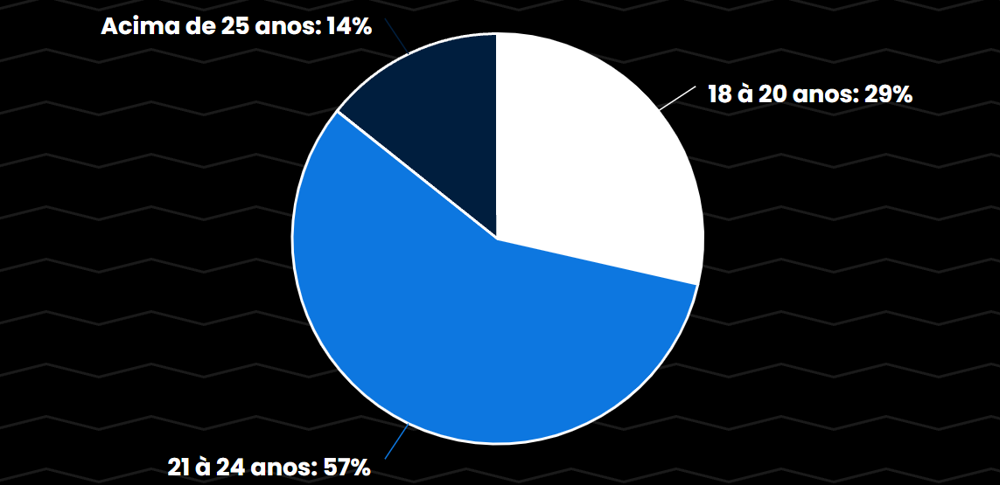
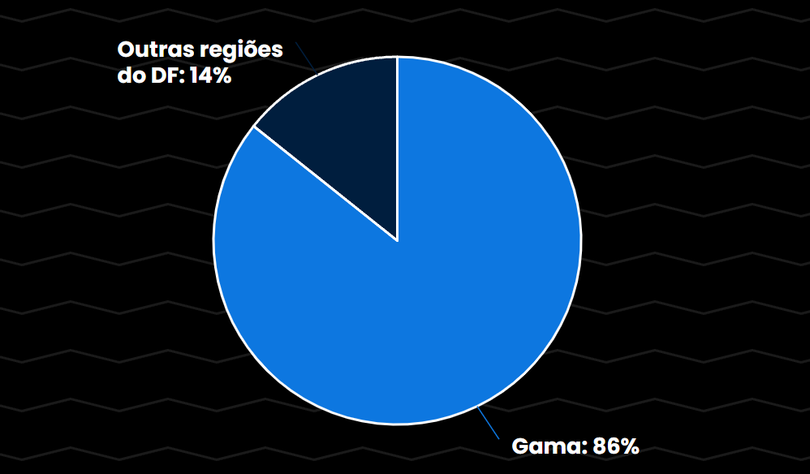
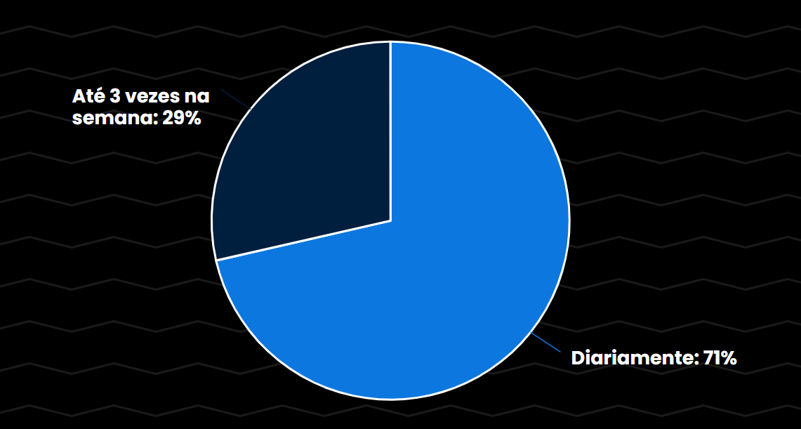
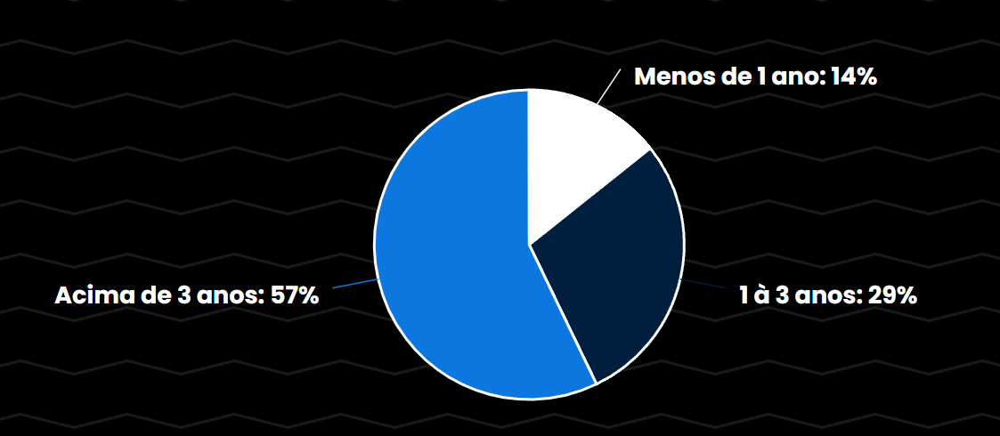
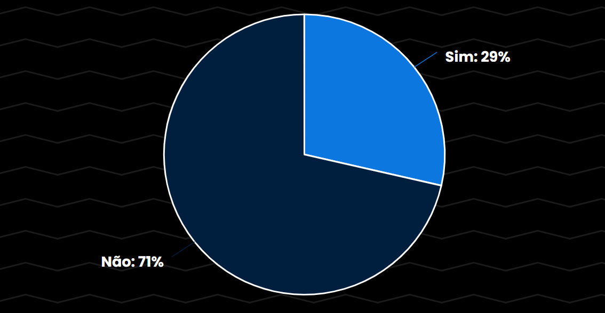
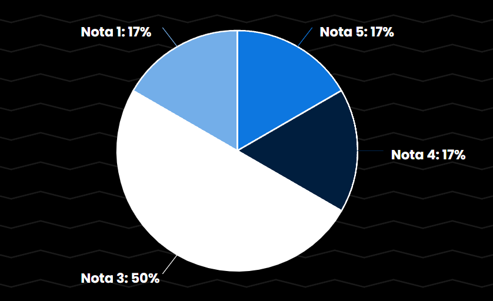
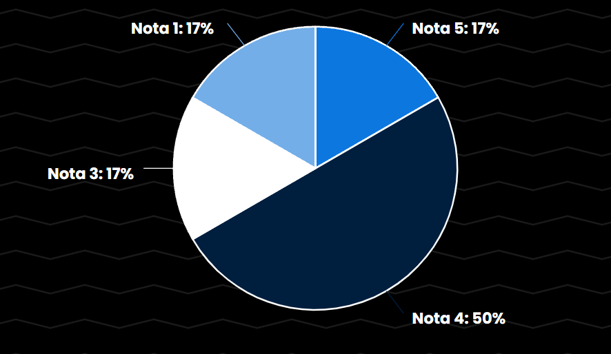

# Perfil de Usuário

## Introdução

Um perfil de usuário é uma coleção de configurações e informações associadas a um usuário. Pode ser definida como a representação digital explícita da identidade do usuário em relação ao ambiente operacional, que pode ser sistemas operacionais, aplicativos de software ou sites. O perfil do usuário ajuda a associar características a um usuário e a determinar o comportamento interativo do usuário, juntamente com as preferências.

## Metodologia

Com o objetivo de criar uma descrição detalhada dos atuais e futuros usuários do site BRB Mobilidade, conduzimos **entrevistas** como fonte de coleta de dados. Essa abordagem nos permite compreender quem são esses usuários, bem como suas necessidades e interesses de forma qualitativa. A definição do perfil do usuário é de extrema importância na análise de requisitos da aplicação, e nossos esforços visam analisar como o BRB Mobilidade atende às expectativas dos usuários. 

É importante ressaltar que existe inúmeros meios para coleta de dados. Além do método de entrevista (realizado pelo grupo), há também outros métodos como grupos de foco, questionários, estudo de campo e etc.

Para realizar as entrevistas para formação do perfil do usuário levamos em conta alguns dados importantes, como: 

 - dados demográficos;
 - afinidade e experiencia com o site;
 - experiência com o transporte público;

## Resultados das Entrevistas

Os resultados das entrevistas foram de bastante importância para o projeto. Durante essas entrevistas os usuários compartilharam suas experiências, pensamentos e opiniões de maneira aberta e franca proporcionando uma visão mais clara sobre o site do BRB Mobilidade.

Abaixo estão algumas perguntas que foram feitas durante a entrevista:

#### 1. Qual a sua idade?

    
Figura 1: Gráfico de respostas da pergunta 1 (Fonte: Arthur Sousa, 2023)

 

#### 2. Qual é o seu gênero?

    
Figura 2: Gráfico de respostas da pergunta 2 (Fonte: Arthur Sousa, 2023)

 

#### 3. Onde você mora ou qual é a sua localização principal?

    
Figura 3: Gráfico de respostas da pergunta 3 (Fonte: Arthur Sousa, 2023)

 

#### 4. Com que frequência você utiliza o transporte público em Brasília?

    
Figura 4: Gráfico de respostas da pergunta 4 (Fonte: Arthur Sousa, 2023)

 

#### 5. Há quanto tempo você reside em Brasília?

    
Figura 5: Gráfico de respostas da pergunta 5 (Fonte: Arthur Sousa, 2023)

 

#### 6. Você costuma compartilhar informações ou opiniões sobre transporte público ou mobilidade com outras pessoas nas redes sociais ou em fóruns online?

    
Figura 6: Gráfico de respostas da pergunta 6 (Fonte: Arthur Sousa, 2023)

 

| 7. Você utiliza algum tipo de benefício tarifário, como descontos para estudantes ou passes mensais, ao utilizar o transporte público?|
|:---------------------------------------------------------------:|
| Não |
| Sim, o cartão estudantil me permite passes mensais.|
| Não|
| Sim, o passe livre para estudante.  |
| Sim, desconto para estudante e o que limita uma passagem |
| Sim, o passe livre estudantil |

    
 
        Tabela 1: Respostas da pergunta 7 (Fonte: Amanda Abreu, 2023).
    

 

    <table>
        <tr>
            <th>8. Quais são as principais áreas da cidade que você costuma visitar com mais frequência?</th>
        </tr>
        <tr>
            <td>Asa norte, asa sul, plano e gama.</td>
        </tr>
        <tr>
            <td>Asa Norte e Gama</td>
        </tr>
        <tr>
            <td>Setor sul</td>
        </tr>
        <tr>
            <td>Faculdade do gama, park shopping e rodoviária interestadual</td>
        </tr>
        <tr>
            <td>Gama, setor de indústria</td>
        </tr>
        <tr>
            <td>Gama, plano piloto, Taguatinga</td>
        </tr>
    </table>
    

        
 
            Tabela 2: Respostas da pergunta 8 (Fonte: Amanda Abreu, 2023).
        

    

 

| 9. Como você avalia a aparência visual e a abordagem minimalista do design do BRB Mobilidade em termos de usabilidade e apelo estético?|
|:---------------------------------------------------------------:|
| Design fácil, a única dificuldade foi pegar o cartão, pois era longe.  |
|Simples e Direto, só alguns formulários (Um atrás do outro) |
| Tem uma aparência ok, poderia ter uma estética mais atual e amigável para o usuário. |
| Acho bem interativo e fácil entendimento  |
| As informações e guia do site é simples e direto |
| Acho fácil de usar e autoexplicativo. |

    
 
        Tabela 3: Respostas da pergunta 9(Fonte: Amanda Abreu, 2023).
    

 

    <table>
        <tr>
            <th>10. Quais são as principais áreas da cidade que você costuma visitar com mais frequência?</th>
        </tr>
        <tr>
            <td>Asa Norte, Asa Sul, Plano e Gama.</td>
        </tr>
        <tr>
            <td>Asa Norte e Gama</td>
        </tr>
        <tr>
            <td>Setor Sul</td>
        </tr>
        <tr>
            <td>Faculdade do Gama, Park Shopping e Rodoviária Interestadual</td>
        </tr>
        <tr>
            <td>Gama, Setor de Indústria</td>
        </tr>
        <tr>
            <td>Gama, Plano Piloto, Taguatinga</td>
        </tr>
    </table>
    <caption>Tabela 4: Respostas da pergunta 10 (Fonte: Amanda Abreu, 2023)</caption>

 

#### 11. Na sua experiência ao utilizar o site do BRB Mobilidade, como você classificaria a facilidade de adaptação e acessibilidade? Por favor, avalie de 1 (muito difícil) a 5 (muito fácil) com base na sua experiência recente.

    
Figura 7: Gráfico de respostas da pergunta 11 (Fonte: Arthur Sousa, 2023)

 

#### 12. Poderia avaliar a eficácia do suporte e das informações disponíveis no site do BRB Mobilidade? Em uma escala de 1 a 5, sendo 1 muito insatisfatório e 5 muito satisfatório, como você classificaria a facilidade de encontrar as informações necessárias e a qualidade do suporte oferecido no site?

    
Figura 8: Gráfico de respostas da pergunta 12 (Fonte: Arthur Sousa, 2023)

## Conclusão 

Com base nas respostas obtidas através das entrevistas podemos concluir que o perfil de usuário que o utiliza o site do BRB Mobilidade seria caracterizado por:

- Gênero: Masculino 
- Idade: Entre 21 e 24 anos 
- Localização: Gama 
- Ocupação: Estudante 
- Objetivos: Os principais objetivos dos usuários são solicitar um cartão, editar informações de conta e solicitar uma segunda via do cartão
  
Essas conclusões são baseadas nas informações coletadas nas entrevistas e fornecem uma visão geral do perfil típico dos usuários do site BRB Mobilidade. Tenha em mente que essas conclusões são baseadas em dados específicos coletados durante as entrevistas e podem ser usadas para orientar estratégias de design e conteúdo do site para melhor atender às necessidades desse público-alvo.

## Histórico de versão

| Versão | Data       |Modificação                             |Autor                         |Revisores                         |
| ------ | ---------- |--------------------------------------- |----------------------------- |-----------------------------------|
|  1.0   | 12/10/2023   | Adicionando introdução | [Arthur Sousa](https://github.com/arthurrsousa) e [Amanda Abreu](https://github.com/Amandaaaaabreu) | [Felipe Hansen](https://github.com/FHansen98) |
|  1.1   | 12/10/2023   | Adicionando perguntas | [Arthur Sousa](https://github.com/arthurrsousa) e [Amanda Abreu](https://github.com/Amandaaaaabreu) | [Arthur Sousa](https://github.com/arthurrsousa)|
|  1.2   | 12/10/2023   | Adicionando legendas e gráficos | [Arthur Sousa](https://github.com/arthurrsousa) e [Amanda Abreu](https://github.com/Amandaaaaabreu) | [Artur Jackson](https://github.com/artur-jack) |
|  1.3   | 12/10/2023   | Adicionando conclusão | [Arthur Sousa](https://github.com/arthurrsousa) e [Amanda Abreu](https://github.com/Amandaaaaabreu) | [Felipe Hansen](https://github.com/FHansen98) |
|  1.4   | 15/10/2023   | Adicionando últimos gráficos | [Arthur Sousa](https://github.com/arthurrsousa) e [Amanda Abreu](https://github.com/Amandaaaaabreu) | [Juan Pablo](https://github.com/Juan-Ricarte) |

## Bibliografia 

[1] Site do Techopedia: <https://pt.theastrologypage.com/user-profile>
