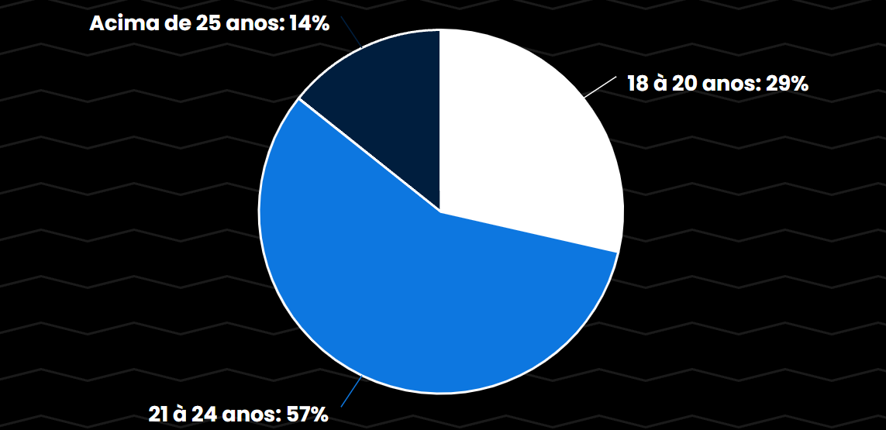
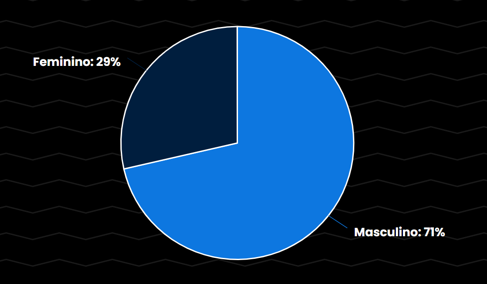
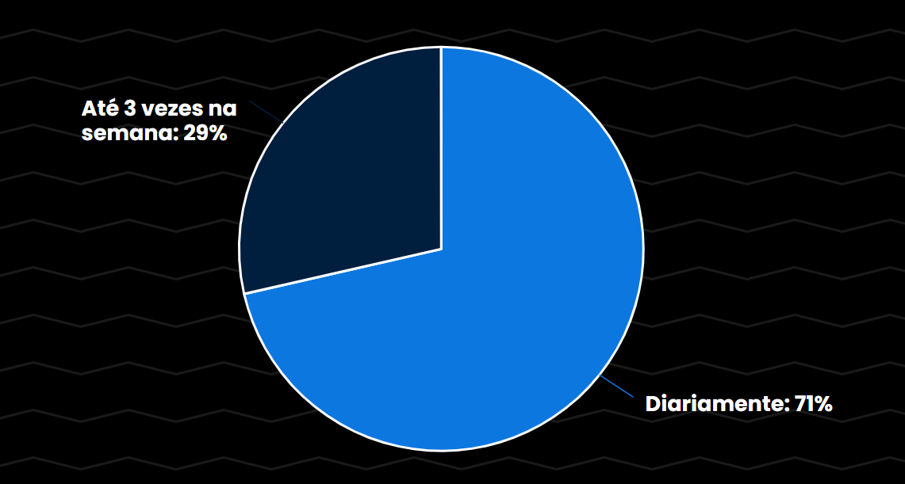
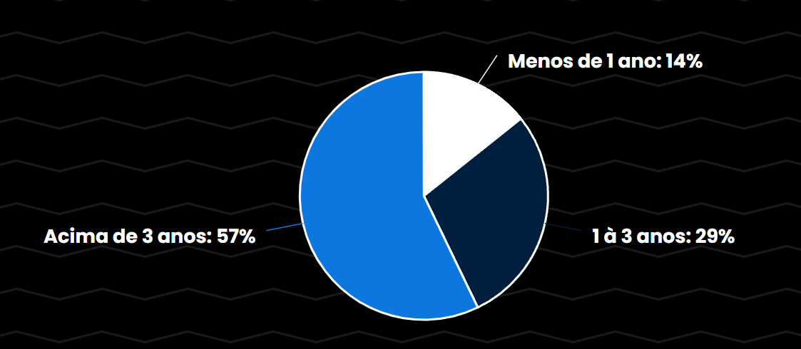
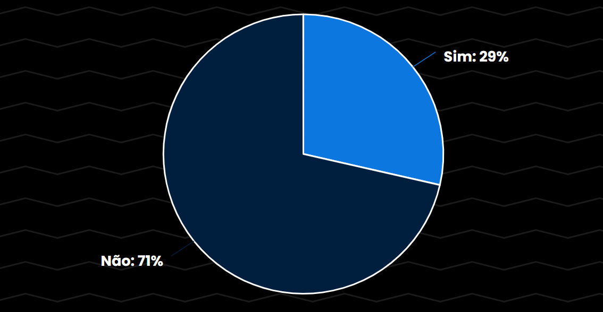

# Perfil de Usuário

## Introdução

Um perfil de usuário é uma coleção de configurações e informações associadas a um usuário. Pode ser definida como a representação digital explícita da identidade do usuário em relação ao ambiente operacional, que pode ser sistemas operacionais, aplicativos de software ou sites. O perfil do usuário ajuda a associar características a um usuário e a determinar o comportamento interativo do usuário, juntamente com as preferências.

## Metodologia

Com o objetivo de criar uma descrição detalhada dos atuais e futuros usuários do site BRB Mobilidade, conduzimos **entrevistas** como fonte de coleta de dados. Essa abordagem nos permite compreender quem são esses usuários, bem como suas necessidades e interesses de forma qualitativa. A definição do perfil do usuário é de extrema importância na análise de requisitos da aplicação, e nossos esforços visam analisar como o BRB Mobilidade atende às expectativas dos usuários. 

É importante ressaltar que existe inúmeros meios para coleta de dados. Além do método de entrevista (realizado pelo grupo) á também outros métodos como grupos de foco, questionários, estudo de campo e etc.

Para realizar as entrevistas para formação do perfil do usuário levamos em conta alguns dados importantes, como: 

 - dados demográficos;
 - afinidade e experiencia com o site;
 - experiência com o transporte público;

## Resultados das Entrevistas

Os resultados das entrevistas foram de bastante importância para o projeto. Durante essas entrevistas os usuários compartilharam suas experiências, pensamentos e opiniões de maneira aberta e franca proporcionando uma visão mais clara sobre o site do BRB Mobilidade.

Abaixo estão algumas perguntas que foram feitas durante a entrevista.

### 1. Qual a sua idade?

    
Figura 1: Gráfico de respostas da pergunta 1 (Fonte: autor, 2023)

 

### 2. Qual é o seu gênero?

    
Figura 2: Gráfico de respostas da pergunta 2 (Fonte: autor, 2023)

 

### 3. Onde você mora ou qual é a sua localização principal?

    
Figura 3: Gráfico de respostas da pergunta 3 (Fonte: autor, 2023)

 

### 4. Com que frequência você utiliza o transporte público em Brasília?

    
Figura 4: Gráfico de respostas da pergunta 4 (Fonte: autor, 2023)

 

### 5. Há quanto tempo você reside em Brasília?

    
Figura 5: Gráfico de respostas da pergunta 5 (Fonte: autor, 2023)

 

### 6. Você costuma compartilhar informações ou opiniões sobre transporte público ou mobilidade com outras pessoas nas redes sociais ou em fóruns online?

    
Figura 6: Gráfico de respostas da pergunta 6 (Fonte: autor, 2023)

 

| 7. Com que frequência você utiliza o transporte público em Brasília?|
|:---------------------------------------------------------------:|
| Todos os dias |
| Diariamente |
| Todos os dias |
| Todos os dias |
| Diariamente |
| Todos os dias    |
| Todos os dias    |

    
 
        Tabela 1: Respostas da pergunta 7 (Fonte: autor, 2023).
    

 

| 8. Você já utilizou o site do BRB Mobilidade? Se sim, com que finalidade?|
|:---------------------------------------------------------------:|
|  Sim, para segunda via de cartão e saldo |
|  Sim, para conseguir o cartão estudantil|
|  Sim, para verificar situação do meu cartão do ônibus |
|Sim, para solicitar o cartão e para solicitar segunda via do cartão  |
| Sim, para solicitar o cartão, para editar informações de cadastro e para solicitar segunda via do cartão  |
| Sim, aumentar passes, pedir segunda via e conferir dados |
| Sim, para atualizações cadastrais  |

    
 
        Tabela 2: Respostas da pergunta 8 (Fonte: autor, 2023).
    

 

| 9. Você utiliza algum tipo de benefício tarifário, como descontos para estudantes ou passes mensais, ao utilizar o transporte público?|
|:---------------------------------------------------------------:|
| Não |
| Sim, o cartão estudantil me permite passes mensais.|
| Não|
| Sim, o passe livre para estudante.  |
| Sim, desconto para estudante e o que limita uma passagem |
| Sim, o passe livre para estudante |
| Sim, o passe livre para estudante |

    
 
        Tabela 3: Respostas da pergunta 9 (Fonte: autor, 2023).
    

 

| 10. Como você avalia a aparência visual e a abordagem minimalista do design do BRB Mobilidade em termos de usabilidade e apelo estético?|
|:---------------------------------------------------------------:|
| Design fácil, a única dificuldade foi pegar o cartão, pois era longe.  |
|Simples e Direto, só alguns formulários (Um atrás do outro) |
| Tem uma aparência ok, poderia ter uma estética mais atual e amigável para o usuário. |
| Diariamente  |
| Diariamente |
| Diariamente |
| Diariamente |

    
 
        Tabela 4: Respostas da pergunta 10 (Fonte: autor, 2023).
    

 

| 11. Em relação à sua experiência como usuário do site do BRB, como você percebe a autonomia e liberdade para realizar suas transações e acessar informações? Quais aspectos específicos você considera cruciais para melhorar a sua liberdade e autonomia nesse ambiente virtual?|
|:---------------------------------------------------------------:|
| Não teve dificuldade  |
|Sinto que não tenho tanta liberdade, visto que vou respondendo formulários seguidos. Gostaria de adicionar local de retirada e ter algum chat online  |
|  Ter mais informações sobre como esses dados são usados |
| Diariamente |
| Diariamente |
| Diariamente |
| Diariamente |

    
 
        Tabela 5: Respostas da pergunta 11 (Fonte: autor, 2023).
    

 

| 12. Quais são as principais áreas da cidade que você costuma visitar com mais frequência?|
|:---------------------------------------------------------------:|
| Asa norte, asa sul, plano e gama. |
|Asa Norte e Gama |
|  Setor sul|
| Faculdade do gama, park shopping e rodoviária interestadual  |
| Gama, setor de indústria |
| Gama, plano piloto, Taguatinga |
| Leste do Gama |

    
 
        Tabela 6: Respostas da pergunta 12 (Fonte: autor, 2023).
    

## Conclusão 

## Histórico de versão

| Versão | Data       |Modificação                             |Autor                         |Revisores                         |
| ------ | ---------- |--------------------------------------- |----------------------------- |-----------------------------------|
|  2.0   | 12/10/2023   | Adicionando introdução | [Arthur Sousa](https://github.com/arthurrsousa) e [Amanda Abreu](https://github.com/Amandaaaaabreu) | --------- |
|  2.1   | 12/10/2023   | Adicionando perguntas | [Arthur Sousa](https://github.com/arthurrsousa) e [Amanda Abreu](https://github.com/Amandaaaaabreu) | --------- |
|  2.2   | 12/10/2023   | Adicionando legendas e gráficos | [Arthur Sousa](https://github.com/arthurrsousa) e [Amanda Abreu](https://github.com/Amandaaaaabreu) | --------- |

## Bibliografia 

[1] Site do Techopedia: <https://pt.theastrologypage.com/user-profile>