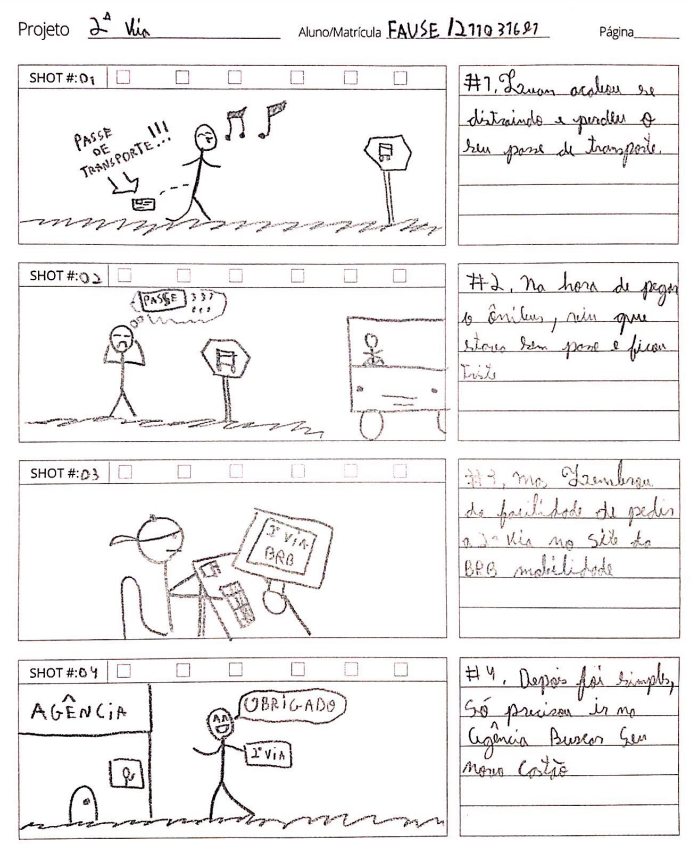

## Introdução

Um storyboard é um exemplo de protótipo de baixa fidelidade. Ele consiste em uma série de desenhos que mostram como um usuário pode realizar uma determinada tarefa utilizando o produto ou sistema em questão. Além disso, essa técnica pode ser utilizada junto com a técnica de cenários, para simular ainda melhor a interação do usuário com a interface mediante a observação desses cenários. Vale ressaltar que alguns [Cenários](../../analiseRequisitos/cenario.md) junto com as [Tarefas](../../analiseRequisitos/analise_tarefas/sobre_analise_tarefas.md) a serem ilustradas já foram documentadas no projeto.

### Storyboard 1

Na figura 1, é apresentado o storyboard feito pela Amanda Abreu, onde é mostrada a tarefa de [**Extensão de Acessos**]().

    
Figura 1: Storyboard de extensão de acessos. (Fonte: Amanda Abreu, 2023)

### Storyboard 2

Na figura 2, é apresentado o storyboard feito pelo Fause Junior, onde é mostrada a tarefa de [**2° Via**]().

    
Figura 2: Storyboard de extensão de acessos. (Fonte: Fause Junior, 2023)

### Storyboard 3

Na figura 3, é apresentado o storyboard feito pelo Artur Jackson, onde é mostrada a tarefa de [**Troca de Instituição**]().

    
Figura 3: Storyboard de troca de instituição. (Fonte: Artur Jackson, 2023)

### Storyboard 4

Na figura 4, é apresentado o storyboard feito pelo Lucas Lobão, onde é mostrada a tarefa de [**Liberar Cartão**]().

    
Figura 4: Storyboard de Liberar Cartão. (Fonte: Lucas Lobão, 2023)

### Storyboard 5

Na figura 5, é apresentado o storyboard feito pelo Arthur Sousa, onde é mostrada a tarefa de [**Meus acessos**]().

    
Figura 5: Storyboard de meus acessos. (Fonte: Arthur Sousa, 2023)

### Storyboard 6

Na figura 6, é apresentado o storyboard feito pelo Juan Pablo, onde é mostrada a tarefa de [Troca de Endereço]().

    
Figura 7: Storyboard de Troca de Endereço. (Fonte: Juan Pablo, 2023)

### Storyboard 7

Na figura 7, é apresentado o storyboard feito pelo Felipe Hansen, onde é mostrada a tarefa de [**Alteração de foto**]().

    
Figura 7: Storyboard de alteração de foto. (Fonte: Felipe Hansen, 2023)

## Histórico de versão

| Versão | Data       | Modificação                             | Autor                         | Revisores                         |
| ------ | ---------- | --------------------------------------- | ----------------------------- | ----------------------------- |
|    1.0   |   28/10/2023   |   Criação da página |  [Arthur Sousa](https://github.com/arthurrsousa) e [Lucas Lobão](https://github.com/lucaslobao-18) |  [Amanda](https://github.com/Amandaaaaabreu)|
