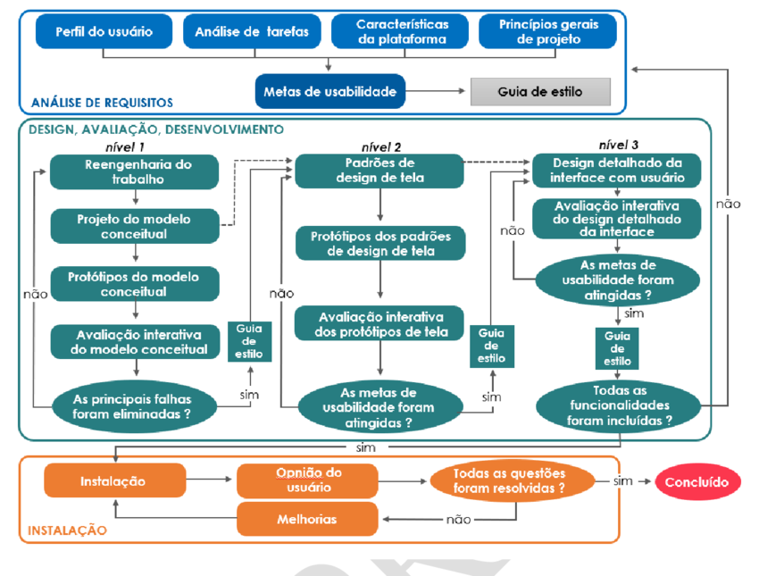

## Introdução

No desenvolvimento do projeto, foi de suma importância a utilização de um processo design da a Engenharia de Usabilidade de Mayhew para guiar o grupo durante todo o processo, A engenharia de Mayhew conta com 3 principais etapas que englobam todas as atividades da área de interação humano computador de forma bem detalhada e explicativa.

## Motivo da Escolha

Tendo em vista que o principal motivo da disciplina Interação Humano-computador é o conhecimento , esse modelo proporciona isso, por ser bastante completo e deixar bem exemplificado como funciona o processo por um todo. O ciclo também é uma opção ideal para as  equipes que possuem pouco experiência neste tipo de trabalho, além de ser o ciclo de vida mais completo em relação aos seus processos , que são iterativos, o que proporciona um contínuo processo de melhoria durante o desenvolvimento.

Assim, o cronograma do projeto foi pautado nas principais etapas deste ciclo, sendo elas análise de requisitos e design, avaliação e desenvolvimento, o que nos proporcionou uma maior organização e um maior aproveitamento em relação ao nosso desempenho 

## Ciclo de vida Mayhew

    
    
Figura 4: Diagrama da Engenharia de Usabilidade de Mayhew (Fonte: The Usability Engineering Lifecycle, MayHew)

## Referências Bibliográficas

> BARBOSA, S. D. J.; SILVA, B. S. Interação Humano-Computador. Rio de Janeiro: Elsevier, 2011

## Histórico de Versão

| Versão | Data       | Modificação                             | Autor                         | Revisores                         |
| ------ | ---------- | --------------------------------------- | ----------------------------- | ----------------------------- |
|    1.0   |   05/12/2023   |   Criação do artefato |  [Fause Carlos](https://github.com/FauseSkyWalker)|[Lucas Lobão](https://github.com/lucaslobao-18)|

