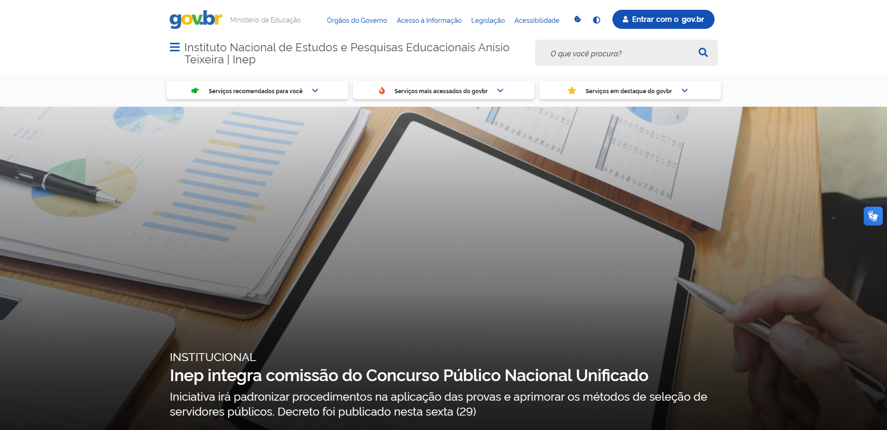

# Sites Avaliados

# Introdução

O objetivo deste tópico é apresentar uma análise dos sites considerados, com o propósito de destacar as características que levaram à escolha do Brb Mobilidade. Para essa decisão, utilizamos as Heurísticas de Nielsen a fim de identificar o site que melhor atendia às necessidades da disciplina.

Antes de chegarmos à conclusão de que o Brb Mobilidade era a opção mais adequada, o grupo apresentou alguns outros sites que também poderiam ser relevantes. Abaixo há uma lista de todos os sites que foram avaliados. 

## [Ministério da Fazenda](https://www.gov.br/fazenda/pt-br)
O site da Fazenda é uma plataforma online oferecida por uma entidade governamental responsável pelas finanças e receitas públicas em um país. Ele oferece várias funcionalidades, incluindo informações fiscais e tributárias, acesso a documentos e formulários, calculadoras de impostos, consultas, acompanhamento de reembolsos, publicações econômicas, notícias, serviços online, informações sobre programas de incentivo fiscal e recursos educacionais.   
Esse site foi projetado para ajudar contribuintes e empresas a entender e cumprir obrigações fiscais e regulatórias, além de fornecer informações econômicas relevantes.

Figura 1: Ministério da Fazenda <div\>

## [Inep](https://www.gov.br/inep/pt-br)
O site do INEP (Instituto Nacional de Estudos e Pesquisas Educacionais Anísio Teixeira) é uma plataforma online do governo brasileiro que disponibiliza informações e serviços relacionados à educação. Suas principais funcionalidades incluem a divulgação de resultados de avaliações, consulta de notas, inscrição em exames, acesso a dados educacionais, pesquisas, informações sobre o Censo Escolar, legislação educacional, provas anteriores, notícias e orientações.  
É uma ferramenta essencial para estudantes, educadores e pesquisadores interessados no sistema educacional brasileiro.

Figura 2: Inep<div\>

## [Ines](https://www.gov.br/ines/pt-br)
O site do INES (Instituto Nacional de Educação de Surdos) é uma plataforma online que oferece informações e recursos relacionados à educação e inclusão de surdos no Brasil. Suas funcionalidades incluem informações institucionais, detalhes sobre serviços e programas, documentação e normativas, recursos para surdos, notícias e eventos, acesso à Língua Brasileira de Sinais (Libras), informações de contato e ênfase na acessibilidade. O site visa apoiar a comunidade surda e promover a inclusão por meio de recursos educacionais e informativos acessíveis.

Figura 3: Ines<div\>

## [Receita Federal](https://www.gov.br/receitafederal/pt-br)
O site da Receita Federal é uma plataforma online oferecida pela agência governamental responsável pela administração de impostos federais em um país. Suas funcionalidades incluem informações tributárias, acesso a documentos e formulários, calculadoras de impostos, consulta de situação fiscal, acompanhamento de restituições, serviços online para transações fiscais, publicações e notícias econômicas, informações sobre programas de incentivo fiscal e recursos educacionais. É uma ferramenta fundamental para que contribuintes e empresas cumpram obrigações fiscais e obtenham informações relacionadas a impostos e finanças governamentais.

Figura 4: Receita Federal<div\>

## [SAE](https://sae.digital)
O site do SAE (Sistema de Apoio ao Estudante) é uma plataforma online usada por instituições educacionais para fornecer suporte e serviços aos estudantes. Suas funcionalidades incluem matrícula, acompanhamento acadêmico, apoio financeiro, comunicação, recursos educacionais, serviços de saúde, agendamento de atendimentos, gerenciamento de documentos e suporte técnico. O objetivo é melhorar a experiência dos estudantes, simplificando processos e fornecendo informações relevantes para o sucesso acadêmico. As funcionalidades podem variar de acordo com a instituição.

Figura 5: SAE<div\>

## [Memorial JK](http://www.memorialjk.com.br)
O site do Memorial JK é a plataforma online oficial dedicada à preservação da memória e legado do ex-presidente brasileiro Juscelino Kubitschek. Suas funcionalidades incluem fornecer informações históricas sobre a vida de Juscelino Kubitschek, possibilitar o agendamento de visitas ao Memorial, apresentar exposições virtuais, divulgar eventos e atividades culturais, fornecer informações de contato, apoiar pesquisas, exibir galerias de fotos e contar a história do próprio Memorial JK. Suas funcionalidades podem variar com o tempo e de acordo com a gestão do Memorial. 

Figura 6: Memorial JK<div\>

## [Escola de Música de Brasília](https://www.escolademusicadebrasilia.com)
O site da Escola de Música de Brasília é uma plataforma online dedicada a fornecer informações e serviços relacionados à instituição. Suas funcionalidades comuns incluem detalhes sobre a escola, cursos oferecidos, eventos musicais, processos de inscrição, recursos para alunos, perfis dos professores, notícias e atualizações, galeria de mídia, informações de contato e perguntas frequentes. No entanto, as características específicas podem variar dependendo da escola e de suas atualizações. É recomendável visitar o site oficial da Escola de Música de Brasília para obter informações precisas e atualizadas sobre seus serviços e recursos.
 

Figura 7: Escola de Música<div\>

## Historico de versão

| Versão | Data       | Modificação                             | Autor                         |
| ------ | ---------- | --------------------------------------- | ----------------------------- |
|    1.0  |   29/09/2023   |   Lista de sites avaliados |  Amanda Abreu|
|    1.1  |   29/09/2023   |   Lista de sites avaliados |  Amanda Abreu|
|    1.2  |   29/09/2023   |   Lista de sites avaliados |  Amanda Abreu|
