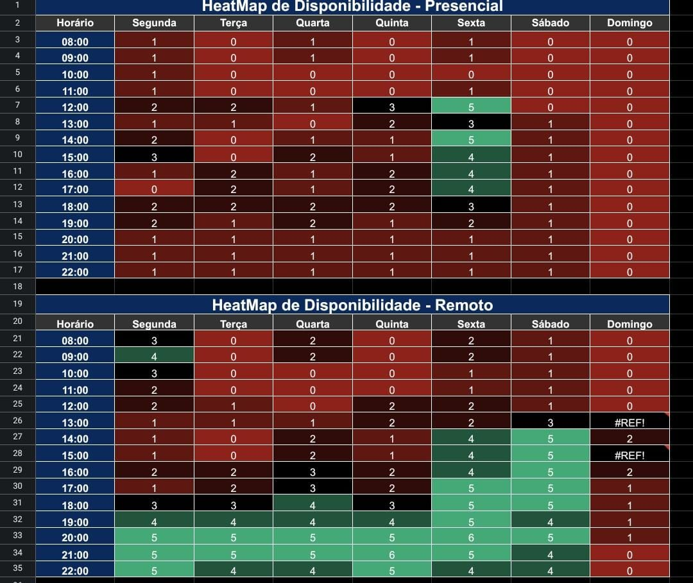

# Heat Map

## Introdução

Na fase inicial do projeto, adotou-se um heat map como uma ferramenta de visualização para proporcionar uma interpretação visual da disponibilidade dos participantes ao longo dos dias da semana.

## Disponibilidade

De acordo com o Heat Map Estabelecido utilizando a ferramenta Excel, foi estabelecido que os encontros semanais ocorrerão no período noturno como mostra o mapa de calor abaixo que descreve a disponibilidade de cada integrante, sendo esses encontros preferencialmente remotos:

    
    
Figura 1: Heat Map (Fonte: autor, 2023)
 

## Bibliografia

## Historico de versão

| Versão | Data       | Modificação                             | Autor                         | Revisores                         |
| ------ | ---------- | --------------------------------------- | ----------------------------- |-----------------------------------|
|    1.0  |   28/09/2023   |   Site selecionado |  [Juan Pablo](https://github.com/Juan-Ricarte) | [Amanda Abreu](https://github.com/Amandaaaaabreu) |

