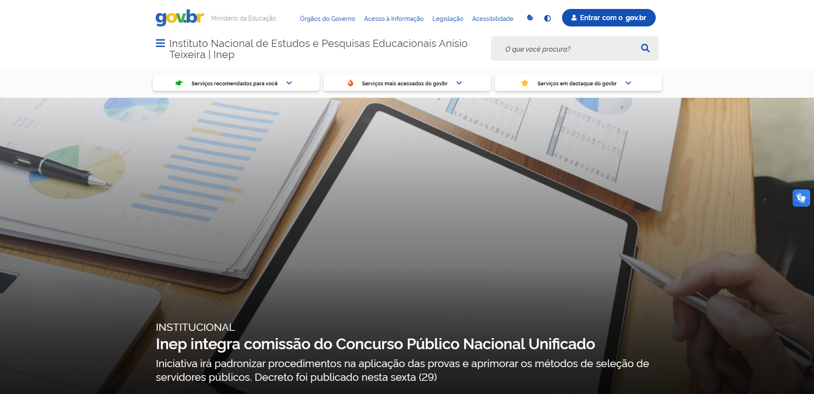

# Sites Avaliados

# Introdução

O objetivo deste tópico é apresentar uma análise dos sites considerados, com o propósito de destacar as características que levaram à escolha do Brb Mobilidade. Para essa decisão, utilizamos as Heurísticas de Nielsen a fim de identificar o site que melhor atendia às necessidades da disciplina.

Antes de chegarmos à conclusão de que o Brb Mobilidade era a opção mais adequada, o grupo apresentou alguns outros sites que também poderiam ser relevantes. Abaixo há uma lista de todos os sites que foram avaliados. 

## [GOV](https://www.gov.br/fazenda/pt-br)
O GOV É uma plataforma online oferecida por uma entidade governamental responsável pelas finanças e receitas públicas em um país. Ele oferece várias funcionalidades, incluindo informações fiscais e tributárias, acesso a documentos e formulários, calculadoras de impostos, consultas, acompanhamento de reembolsos, publicações econômicas, notícias, serviços online, informações sobre programas de incentivo fiscal e recursos educacionais.  

Esse site foi projetado para ajudar contribuintes e empresas a entender e cumprir obrigações fiscais e regulatórias, além de fornecer informações econômicas relevantes. 

O site foi avaliado de acordo com os 10 métodos de inspeção heurística, abaixo adicionamos alguns: 

- Ajuda e documentação: A informação desejada não é encontrada e nem mesmo pelos mecanismos de ajuda.
  
- Controle e liberdade do usuário: O usuário não consegue voltar à página anterior a não ser que utilize o mecanismo do próprio navegador
  
- Reconhecimento em vez de memorização: Ao acessar o site, o usuário não tem um caminho lógico que consiga seguir para acessar a área de usuários MEI sem que tenha que lembrar o caminho que percorreu das outras vezes.
  
- Prevenção de erros: O domínio possui um erro gravíssimo que tira a confiança do usuário em relação à sua segurança.

    
    
Figura 1: Ministério da Fazenda (Fonte: https://www.gov.br/fazenda/pt-br)
 

## [Inep](https://www.gov.br/inep/pt-br)
O site do INEP (Instituto Nacional de Estudos e Pesquisas Educacionais Anísio Teixeira) é uma plataforma online do governo brasileiro que disponibiliza informações e serviços relacionados à educação. Suas principais funcionalidades incluem a divulgação de resultados de avaliações, consulta de notas, inscrição em exames, acesso a dados educacionais, pesquisas, informações sobre o Censo Escolar, legislação educacional, provas anteriores, notícias e orientações. 

É uma ferramenta essencial para estudantes, educadores e pesquisadores interessados no sistema educacional brasileiro.

O site foi avaliado de acordo com os 10 métodos de inspeção heurística, abaixo adicionamos alguns: 

- Controle e Liberdade do Usuário: O sistema não fornece feedback claro e imediato em resposta às ações dos usuários. 
  
- Prevenção de Erros:Não fornece feedback visual imediato quando o usuário executa ações é essencial, por exemplo: mensagem de erro. 
- Reconhecimento, Diagnóstico e Recuperação de Erros 
  
- Ajuda e Documentação: O site não oferece uma documentação 100% atualizada. 

    
    
Figura 2: Inep (Fonte: https://www.gov.br/inep/pt-br)

## [Receita Federal](https://www.gov.br/receitafederal/pt-br)
O site da Receita Federal é uma plataforma online oferecida pela agência governamental responsável pela administração de impostos federais em um país. Suas funcionalidades incluem informações tributárias, acesso a documentos e formulários, calculadoras de impostos, consulta de situação fiscal, acompanhamento de restituições, serviços online para transações fiscais, publicações e notícias econômicas, informações sobre programas de incentivo fiscal e recursos educacionais. É uma ferramenta fundamental para que contribuintes e empresas cumpram obrigações fiscais e obtenham informações relacionadas a impostos e finanças governamentais. 

O site foi avaliado de acordo com os 10 métodos de inspeção heurística, abaixo adicionamos alguns: 

- Visibilidade do Status do Sistema: O site escolhido tem uma visibilidade
aceitável, porém acredito que tenha muita informação contida em um frame
apenas e também esteja bastante poluído, o que seria um ponto negativo se
considerarmos o acesso de um usuário que não tenha tanto costume ou
contato com a internet. Há uma presença um pouco exagerada de símbolos e
ícones que chamam a atenção indevida. 

- Consistência e Padronização: O site apresenta uma identidade e um design
visual coerente com o que é utilizado em sites governamentais.
 
- Eficiência e flexibilidade do uso: Os serviços oferecidos pelo site são eficientes porém não são flexíveis para usuários que apresentem alguma deficiência ou dificuldade de acessar a internet pois há uma poluição a ser considerada no site e textos bastantes difíceis de se compreender (textos técnicos). Além de alguns serviços oferecidos não serem realizados na própria página, como o de “Consultar dívidas e Pendências Fiscais” que redireciona o usuário para o site da fazenda, site esse que está desatualizado, não está padronizado, não é interativo e nem acessível para todos os públicos.
 
- Controle e Liberdade do Usuário: O usuário não tem total liberdade para naevgar ao site ou realizar alguma pesquisa sem está logado. 
 

    
    
Figura 4: Receita Federal (Fonte: https://www.gov.br/receitafederal/pt-br)

## [SAE](https://sae.digital)
O site do SAE (Sistema de Apoio ao Estudante) é uma plataforma online usada por instituições educacionais para fornecer suporte e serviços aos estudantes. Suas funcionalidades incluem matrícula, acompanhamento acadêmico, apoio financeiro, comunicação, recursos educacionais, serviços de saúde, agendamento de atendimentos, gerenciamento de documentos e suporte técnico. O objetivo é melhorar a experiência dos estudantes, simplificando processos e fornecendo informações relevantes para o sucesso acadêmico. As funcionalidades podem variar de acordo com a instituição. 

O site foi avaliado de acordo com os 10 métodos de inspeção heurística, abaixo adicionamos alguns: 

- Prevenção de Erros: O site não é projetado de maneira a evitar erros dos usuários. Por exemplo, ao preencher formulários, não aparecem mensagens claras de erro caso haja campos obrigatórios em branco, o que ajudaria os usuários a corrigir problemas facilmente.

- Visibilidade do Status do Sistema: A plataforma possui péssima visibilidade do status do sistema. Ao navegar pelas opções do menu inicial, não fica claro ao usuário que o objetivo foi alcançado, ou se houve algum problema.

- Ajuda e Documentação: O site oferece uma seção de ajuda e documentação para os usuários. Os visitantes podem encontrar informações sobre os recursos oferecidos pelo site. assim como seus métodos de acesso.

   

    
    
Figura 5: SAE (Fonte: https://sae.digital)

## [Memorial JK](http://www.memorialjk.com.br)
O site do Memorial JK é a plataforma online oficial dedicada à preservação da memória e legado do ex-presidente brasileiro Juscelino Kubitschek. Suas funcionalidades incluem fornecer informações históricas sobre a vida de Juscelino Kubitschek, possibilitar o agendamento de visitas ao Memorial, apresentar exposições virtuais, divulgar eventos e atividades culturais, fornecer informações de contato, apoiar pesquisas, exibir galerias de fotos e contar a história do próprio Memorial JK. Suas funcionalidades podem variar com o tempo e de acordo com a gestão do Memorial.  

O site foi avaliado de acordo com os 10 métodos de inspeção heurística, abaixo adicionamos alguns: 

- Visibilidade do estado do sistema: Em virtude de o sistema não ser muito complexo, sendo um site mais informativo, 
em geral consegue entregar feedbacks do que está acontecendo para o usuário. 
Apesar de que em algumas iterações o sistema apresenta um tempo de resposta 
maior do que o normal.

- Consistência e padronização: As inconsistências encontradas foram que em algumas abas a página se encontra 
em posições um pouco diferentes. Além de não seguir padrões de acessibilidade 
definidos pelo W3C. Como não possuir opção de conteúdo não textual, que tornaria
o conteúdo multimídia acessível e facilitaria a percepção do conteúdo.

- Projeto estético e minimalista:  Projeto estético e minimalista
O site apresenta um design ultrapassado para atualidade e não minimalista onde 
em alguns momentos pode desanimar o usuário a explorar outras abas do site.

- Ajuda e documentação: Não há presença de documentação auxiliar de fácil acesso. 

    
    
Figura 6: Memorial JK (Fonte: http://www.memorialjk.com.br)

## [Escola de Música de Brasília](https://www.escolademusicadebrasilia.com)
O site da Escola de Música de Brasília é uma plataforma online dedicada a fornecer informações e serviços relacionados à instituição. Suas funcionalidades comuns incluem detalhes sobre a escola, cursos oferecidos, eventos musicais, processos de inscrição, recursos para alunos, perfis dos professores, notícias e atualizações, galeria de mídia, informações de contato e perguntas frequentes. No entanto, as características específicas podem variar dependendo da escola e de suas atualizações. É recomendável visitar o site oficial da Escola de Música de Brasília para obter informações precisas e atualizadas sobre seus serviços e recursos.

O site foi avaliado de acordo com os 10 método de inspeção heurística, abaixo adicionamos alguns: 

- Flexibilidade e Eficiência de Uso: : O site não oferece opções de personalização
(de uso ou meramente estética).

- Design Estético e Minimalista:  O design do site  não é totalmente limpo e focado no conteúdo
relevante. A alguns elementos desnecessários na página. 

- Reconhecimento, Diagnóstico e Recuperação de Erros: A utilização de ícones de link 🔗em algumas palavras e
elementos do texto mesmo não havendo nenhum link.

- Controle e Liberdade do Usuário: A página possui informações diversas dispostas
uma abaixo da outra, fazendo com que a página tenha uma extensa faixa de
rolagem, o que tornar a experiência um pouco cansativa

    
    
Figura 7: Escola de Música (Fonte: https://www.escolademusicadebrasilia.com)

## [BRB Mobilidade](https://mobilidade.brb.com.br/passelivre/)

Dentre os sites analisados de forma individual, o escolhido foi o "[BRB Mobilidade](https://mobilidade.brb.com.br)". Esse é um sítio gratuito, disponível para uso, de forma online na internet, o qual teve seu projeto inicial realizado para atender aos usuários do cartão de mobilidade no transporte público do Distrito Federal com o inutito de unificar o processo de bilhetagem. 

O site foi avaliado de acordo com os 10 métodos de inspeção heurística, abaixo adicionamos alguns: 

- Visibilidade do estado do sistema: O site apresenta uma boa
visibilidade do status do sistema. Quando os usuários navegam pelo site,
eles são informados sobre onde estão e como podem acessar diferentes
seções.

- Consistência e padronização: O site mantém uma aparência consistente em
todas as páginas, com menus e elementos de navegação localizados nos
mesmos lugares. Isso ajuda os usuários a se sentirem familiarizados e
confortáveis ao explorar o site.  

- Projeto estético e minimalista: De certa forma o design é minimalista, mas na tela de cadastro a uma poluição de informações maior que nas telas iniciais. 

- Ajuda e documentação: O site oferece uma seção de ajuda e documentação
para os usuários.
  

    
    
Figura 8 -  BRB Mobilidade. (Fonte: https://mobilidade.brb.com.br/passelivre/)

## Historico de versão

| Versão | Data       | Modificação                             | Autor                         | Revisores                         |
| ------ | ---------- | --------------------------------------- | ----------------------------- |-----------------------------------|
|    1.0  |   29/09/2023   |   Lista de sites avaliados | [Amanda Abreu](https://github.com/Amandaaaaabreu) | [Felipe Hansen](https://github.com/FHansen98) |
|    1.1  |   29/09/2023   |   Lista de sites avaliados | [Amanda Abreu](https://github.com/Amandaaaaabreu) | [Fause Carlos](https://github.com/FauseSkyWalker) |
|    1.2  |   04/10/2023   |   Heurísticas dos sites avaliados | [Amanda Abreu](https://github.com/Amandaaaaabreu) | [Juan Pablo](https://github.com/Juan-Ricarte) |
|    1.3  |   14/10/2023   |   Atualizações das Heurísticas dos sites avaliados | [Amanda Abreu](https://github.com/Amandaaaaabreu) | [Felipe Hansen](https://github.com/FHansen98) |

## Bibliografia
* [https://brbnovo.brb.com.br/mobilidade/](https://brbnovo.brb.com.br/mobilidade/)
* [https://sae.digital](https://sae.digital)
* [https://www.escolademusicadebrasilia.com](https://www.escolademusicadebrasilia.com)
* [https://www.gov.br/receitafederal/pt-br](https://www.gov.br/receitafederal/pt-br)
* [https://www.gov.br/inep/pt-br](https://www.gov.br/inep/pt-br)
* [Mhttps://www.gov.br/pt-br](https://www.gov.br/pt-br)
* [http://www.memorialjk.com.br](http://www.memorialjk.com.br)
