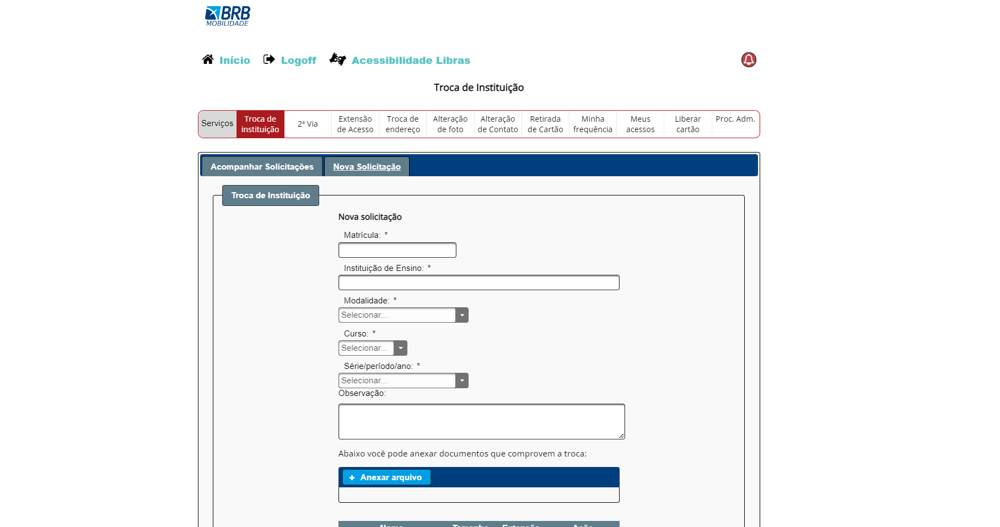
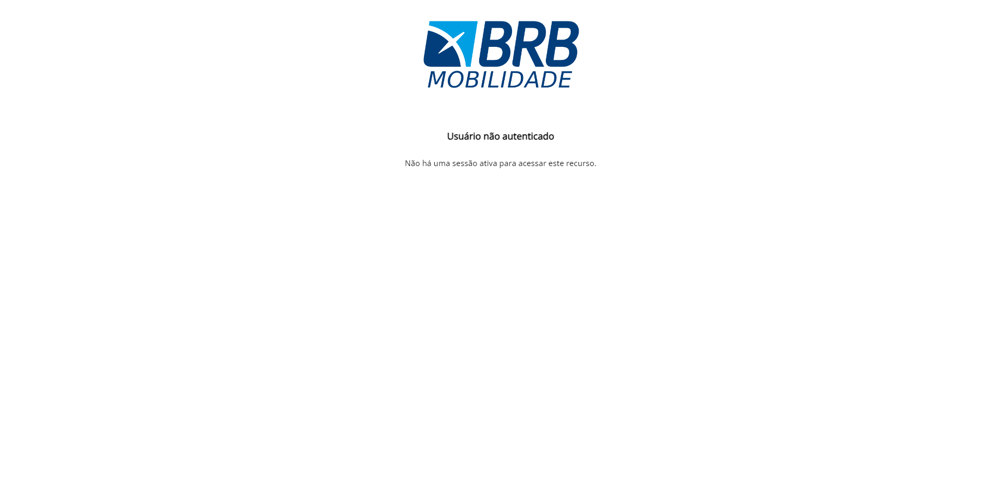
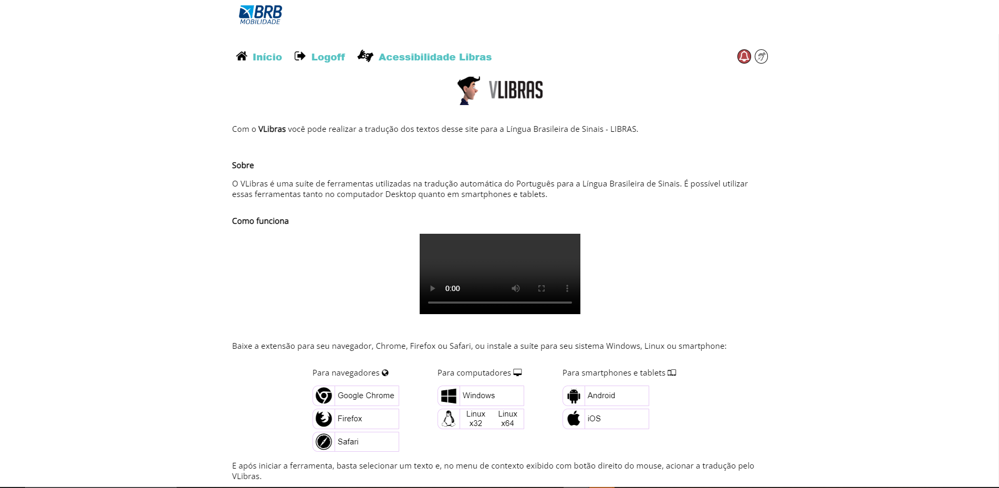
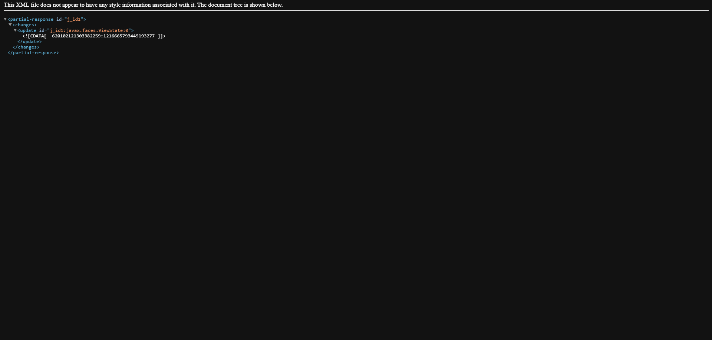

# Site selecionado 

## Introdução

Na primeira fase do projeto, os estudantes escolheram individualmente websites, priorizando os do governo ou de comunidades de software livre, para propor um projeto na disciplina de Interação Humano-Computador. Cada aluno fez uma breve avaliação do seu site escolhido, e depois houve discussões em grupo para determinar qual site seria trabalhado. As escolhas e avaliações de cada aluno podem ser encontradas neste [link](./lista_Site.md).

## Website escolhido pela equipe

Após a seleção individual, as sugestões foram debatidas pelo grupo, considerando os critérios a seguir:

- O website ainda não foi abordado na disciplina de Interação Humano Computador.
- O website apresenta questões de usabilidade.
- O website pertence ao governo ou a uma comunidade de software livre.
- Os usuários do website podem acessá-lo facilmente.

## BRB MOBILIDADE

Dentre os sítios analisados de forma individual, o escolhido foi o "[BRB Mobilidade](https://mobilidade.brb.com.br)". Esse é um sítio gratuito, disponível para uso, de forma online na internet, o qual teve seu projeto inicial realizado para atender aos usuários do cartão de mobilidade no transporte público do Distrito Federal com o inutito de unificar o processo de bilhetagem.

    
    
Figura 1 - Imagem da página inicial do sítio eletrônico BRB Mobilidade. (Fonte: <a href="https://mobilidade.brb.com.br">mobilidade.br.com</a>)

## Problemas Encontrados:

- Aparência visual e abordagem minimalista do design

    
    
Figura 2 - Aba "troca de Instituição" - BRB Mobilidade. (Fonte: <a href="https://mobilidade.brb.com.br">mobilidade.br.com</a>)

- Autonomia e liberdade do usuário:

    
    
Figura 3 - Usuário não autenticado - BRB Mobilidade. (Fonte: <a href="https://mobilidade.brb.com.br">mobilidade.br.com</a>)

- Adaptabilidade e eficácia na utilização e Acessibilidade:

    
    
Figura 4 - Acessibilidade e Adaptabilidade- BRB Mobilidade. (Fonte: <a href="https://mobilidade.brb.com.br">mobilidade.br.com</a>)

- Assistência e informações de suporte:

    
    
Figura 5 - Assistência e suporte de erros - BRB Mobilidade. (Fonte: <a href="https://mobilidade.brb.com.br">mobilidade.br.com</a>)

## Histórico de versão

| Versão | Data       | Modificação                             | Autor                         | Revisores                         |
| ------ | ---------- | --------------------------------------- | ----------------------------- |-----------------------------------|
|  1.0   | 28/09/2023 |   Declaração do Site Selecionado | [Juan Pablo](https://github.com/Juan-Ricarte) | [Amanda Abreu](https://github.com/Amandaaaaabreu) |
|  1.1   | 04/10/2023 |   Declaração do Site Selecionado | [Juan Pablo](https://github.com/Juan-Ricarte) | [Amanda Abreu](https://github.com/Amandaaaaabreu) |

## Bibliografia

[1] BARBOSA, Simone; DINIZ, Bruno. Interação Humano-Computador. Editora Elsevier, Rio de Janeiro, 2010.

[2] Plataforma BRB Mobilidade: <https://mobilidade.brb.com.br>. 
