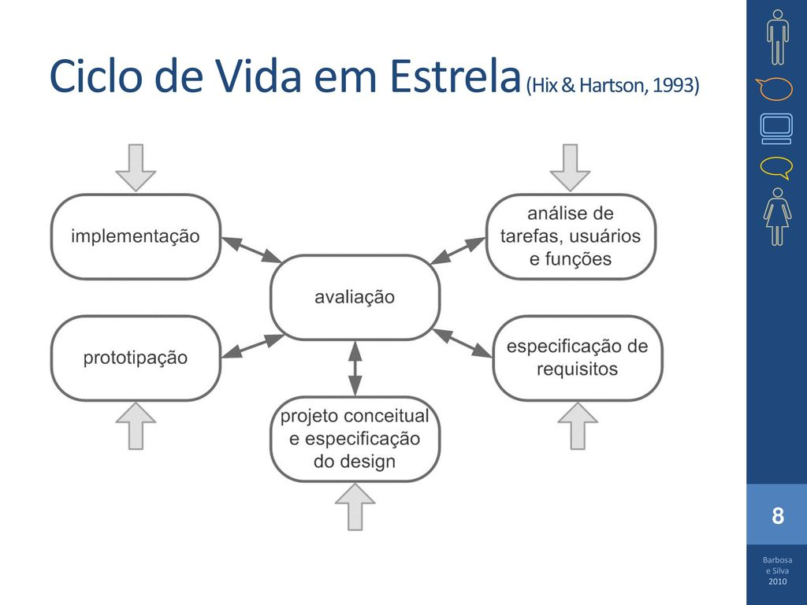
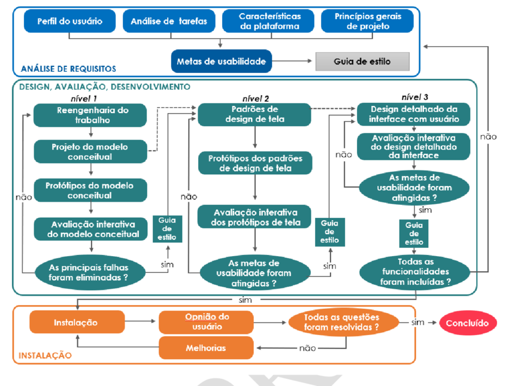

# Processo de Design

## Introdução
O processo de design é uma abordagem sistemática para abordar problemas e desenvolver soluções. Apesar de existirem várias formas de abordar um problema de IHC, geralmente, os processos de design giram em torno de 3 etapas básicas: análise da situação atual (identificação do problema), síntese de uma intervenção (proposta de solução), e avaliação da intervenção projetada ou já aplicada. Essas atividades podem ser executadas de forma interativa, permitindo refinamentos sucessivos do problema e da solução. O objetivo do processo de design é chegar a uma solução satisfatória para o problema identificado.

Dito isso, iremos explicar brevemente sobre alguns desses processos mais conhecidos

## Modelos

### Ciclo de Vida Simples
Ciclo de vida simplificado que gira em torno de 4 atividades básicas (Identificar necessidades e definir requisitos, (re)design, construir uma versão interativa, avaliar). Elas são executadas em sequência mas não há impedimento para retornar à fase anterior caso seja necessário. Esse é um processo simples, o que pode dificultar um pouco o entendimento pela falta de detalhamento das fases.

### Design Contextual;
O design contextual é um método de design de Interação Humano-Computador (IHC) que se concentra na compreensão profunda das necessidades dos usuários por meio de uma análise detalhada do contexto de uso. Esse processo envolve várias etapas, incluindo investigação contextual, modelagem do trabalho, consolidação de dados, redesenho do trabalho, projeto da interface do usuário, prototipagem e teste com os usuários. Na investigação contextual, os designers buscam conhecer os usuários, suas necessidades e como eles realizam suas tarefas diárias no ambiente de trabalho. Essas informações são cruciais para informar o processo de design. A partir disso, são desenvolvidos modelos de trabalho que representam o trabalho de cada usuário investigado, e esses modelos são consolidados para criar um conjunto de dados corporativos que orienta o projeto de IHC.

### Design Baseado em Cenários;
O design baseado em cenários utiliza histórias ou cenários para representar as atividades dos usuários e orientar todas as etapas do desenvolvimento de uma solução. Esses cenários são narrativas simples sobre como as pessoas realizam tarefas, escritas em linguagem natural, o que facilita a participação de todos os envolvidos no sistema no processo de design. Ao escrever, revisar e discutir esses cenários, a equipe de design e os usuários têm a oportunidade de explorar como a tecnologia existente afeta as atividades dos usuários e como o sistema em desenvolvimento pode influenciá-las. Os cenários também estimulam a criatividade, permitindo que a equipe explore diferentes caminhos e ideias alternativas. Esse processo é iterativo e inclui a análise do problema, a concepção da solução de IHC, a prototipagem e a avaliação da solução proposta.

### Design Centrado na Comunicação;
O design centrado na comunicação abrange três atividades principais: análise do usuário, domínio e contexto de uso, projeto de interação e interface, e avaliação da solução projetada. Ele enfatiza a importância de antecipar as dúvidas dos usuários durante a interação e projetar a interface de forma a evitar ou resolver essas dúvidas. Além disso, destaca a necessidade de projetar a conversa entre usuário e sistema, representando-a adequadamente na interface. Embora os usuários desempenhem um papel fundamental nas atividades de análise e avaliação, a responsabilidade de elaborar a metacomunicação e a solução de IHC está sobre os designers, com base nas informações obtidas com a participação dos usuários ao longo do processo.

### Ciclo de Vida em Estrela;

Este modelo, desenvolvido por Hix e Hartson, não possui uma ordem padronizada ao iniciar as atividades, dessa maneira é possível iniciar o processo a partir de qualquer ponta da estrela, isso dependendo de qual sistema está sendo analisado. Tem como principal objetivo a avaliação, que está localizada no centro do diagrama, reforçando a necessidade desta etapa durante todo o processo

### Engenharia de Usabilidade de Nielsen;

A engenharia de Usabilidade,construída por Jakob Nielsen é um conjunto de atividades que são necessárias durante o ciclo de vida do produto, mais especificamente no começo do projeto.Sendo então as atividades:

- Conhecer o usuário

- Análise Competitiva

- Definir as metas de usabilidade

- Adotar designs paralelos

- Adotar o design participativo

- Design Coordenado da Interface

- Aplicação de Diretrizes e Análise Heurística:

- Prototipagem

- Realizar testes Empíricos:

- Design Iterativo:

### Engenharia de Usabilidade de Mayhew

Já a engenharia de Usabilidade, Desenvolvida por Deborah Mayhew, é uma solução iterativa, por meio de um ciclo de vida com visão holística, sendo então dividida em tres principais etapas

- Análise de requisitos: Nesta etapa é feita uma análise dos perfis do usuário para definir quais serão as metas de usabilidade,além da análise de tarefas, possibilidades e as limitações que são encontradas nas plataformas  de execução do sistema

- Já a etapa de design, tem como foco analisar e definir qual a melhor solução em ihc que consiga suprir e solucionar as metas de usabilidade. Este processo é desenvolvido em três níveis diferentes, como é visto no diagrama abaixo

- Já a instalação são coletados as opiniões e feedbacks dos usuários, dessa forma criando um parâmetro para melhoria em versões futuras

## Modelo ultilizado

O modelo escolhido pelo grupo para ser utilizado no projeto foi o ciclo de vida de Mayhew, tendo em vista que o principal motivo da disciplina Interação Humano-computador é a aprendizagem, esse modelo proporciona isso, por ser bastante completo e deixar bem exemplificado como funciona o processo por um todo.

O ciclo também foi escolhido por ser uma opção ideal para equipe que possuem pouco experiência neste tipo de trabalho além de ser o ciclo de vida mais completo em relação aos seus processos , que são iterativos, o que proporciona um contínuo processo de melhoria durante o desenvolvimento 

### Bibliografia

<!-- - BARBOSA, Simone; DINIZ, Bruno. **Interação Humano-Computador**, Editora Elsevier, Rio de Janeiro, 2010.

 -->

> BARBOSA, Simone; DINIZ, Bruno. **Interação Humano - Computador**, Editora Elsevier, Rio de Janeiro, 2010.

## Histórico de versão

| Versão | Data       | Modificação                             | Autor                         | Revisores                         |
| ------ | ---------- | --------------------------------------- | ----------------------------- | ----------------------------- |
|    1.0   |   28/09/2023   |   Criação do layout |  [Fause Carlos](https://github.com/FauseSkyWalker)|------------------|
|    1.0   |   28/09/2023   |   Adicionado alguns ciclos de vida e o modelo escolhido |  [Fause Carlos](https://github.com/FauseSkyWalker)|------------------|
|    1.1   |   30/09/2023   |   Adicionado alguns ciclos de vida |  [Lucas Lobão](https://github.com/lucaslobao-18)|------------------|

## Bibliografia
